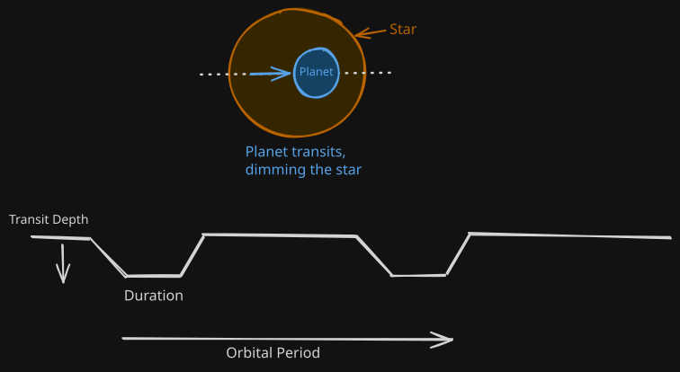
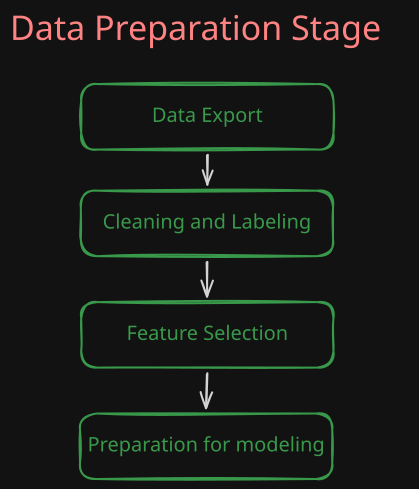
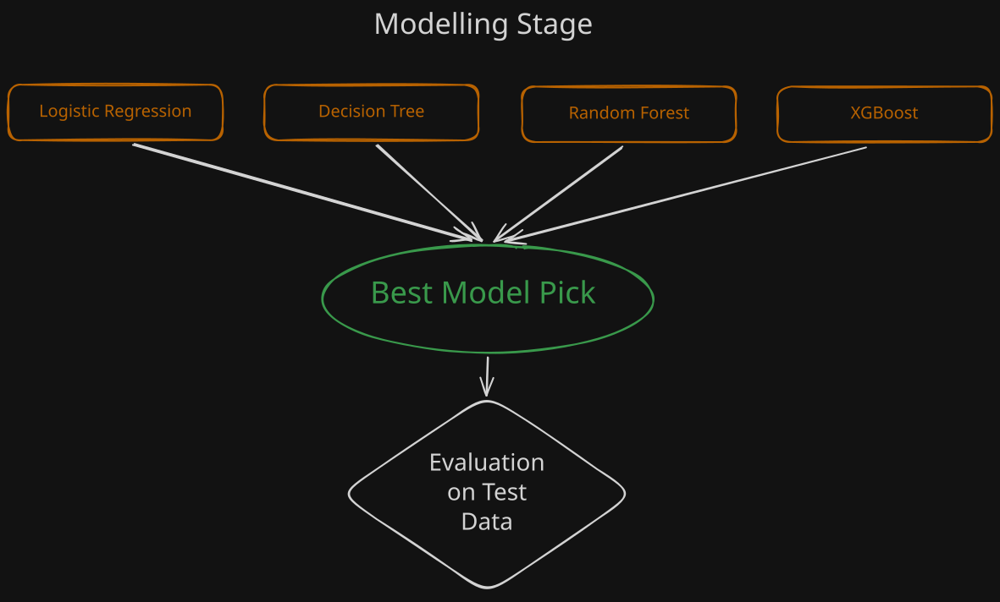

# Exoplanet Candidate Vetting Pipeline

> Status: **In progress**

A machine learning pipeline that predicts whether a TESS-detected transit signal is a real exoplanet or a false positive, using the same disposition labels NASA's TESS Follow-up Observing Program (TFOPWG) assigns after manual review.

## Why this problem

When TESS spots a star dimming on a regular schedule, that dip could be a genuine planet transiting it or it could be caused by something else entirely (an instrument artifact, background noise, two stars passing by etc). Right now a human review team manually labels each candidate as confirmed, false positive, or still pending. This project trains a model to approximate that same call directly from the measured properties of the transit and its host star.

## Data

Source: [NASA Exoplanet Archive — TESS Project Candidates (TOI) Table](https://exoplanetarchive.ipac.caltech.edu/cgi-bin/TblView/nph-tblView?app=ExoTbls&config=TOI)

- ~8,100 candidate rows, pulled as a static CSV snapshot (the live table updates roughly weekly, so results here reflect the data as of the download date, not the current live table).
- Label used: `tfopwg_disp`, collapsed to a binary target —
  - `1` (real planet): **CP** (confirmed planet), **KP** (known planet)
  - `0` (not a planet): **FP** (false positive), **FA** (false alarm)
  - Rows labeled **PC** (candidate) or **APC** (ambiguous candidate) are excluded, since those dispositions are still pending and not a settled judgment.

## Features

**Transit properties:** orbital period, transit duration, transit depth, planet radius, insolation, equilibrium temperature
**Host star properties:** apparent magnitude, distance, effective temperature, surface gravity, stellar radius

Excluded on purpose:
- Right ascension / declination (sky coordinates) — including these risks the model learning where known planets happen to cluster in the sky, rather than learning the actual transit signal.
- All `*err1` / `*err2` / `*lim` uncertainty and limit-flag columns, plus identifiers and update timestamps — not predictive signal for a first pass.

## Pipeline

1. **Export** — pull a snapshot of the TOI table as CSV.
2. **Clean & label** — filter to CP/KP/FP/FA rows, build the binary target, impute missing values.
3. **Select features** — keep transit + stellar property columns described above.
4. **Split** — train / validation / test.

5. **Compare models** — Decision Tree, Random Forest, and XGBoost, tuned via validation AUC.
6. **Evaluate** — best model scored once on the held-out test set.

## Results

_TODO — fill in once hyperparameter tuning is finalized. An early, untuned Random Forest pass reached ~0.89 validation AUC, which is a sanity-check number, not a final result._

| Model | Validation AUC | Test AUC |
|---|---|---|
| Logistic Regression | — | — |
| Decision Tree | — | — |
| Random Forest | — | — |
| XGBoost | — | — |

## Tech stack

Python, Pandas, NumPy, Scikit-learn, XGBoost

## Data source citation

Data from the [NASA Exoplanet Archive](https://exoplanetarchive.ipac.caltech.edu/), operated by the California Institute of Technology, under contract with NASA.
